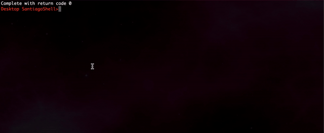

# Custom-Shell
Custom shell as a Python Script using OS module. Also, it supports linux commands and run external programs.

COMMANDS 
1. info XX    - Checks file/dir exists
2. files      - Shows files in directory
3. delete XX  - Checks directory/ file exists and delete it
4. copy XX YY - Copies XX in YY
5. where      - Shows current directory
6. down DD    - Checks directory exists and enters
7. up         - Check you're not in the root and goes up in the directory tree
8. finish     - terminate program
9. program name to run external program

Type any linux command - It will work! :)

<b> Demo </b> 

